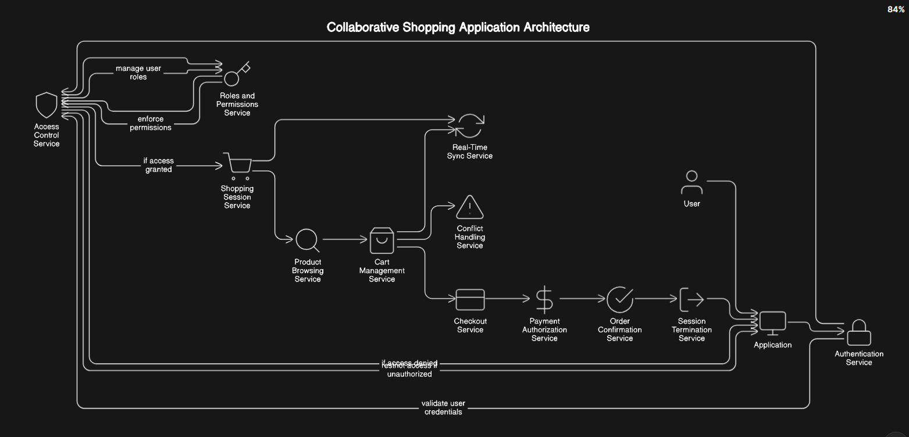

# Real-Time-Collaborative-Shopping
This project is a real-time collaborative shopping app using Django, Django REST Framework, and WebSockets with JWT authentication. Users can register, log in, and share shopping carts with family members, updating items in real time. Key features include product management, and real-time cart updates using Django Channels and Redis.


 <!-- Replace with an actual animated banner URL -->

## 📋 Overview


## 🚀 Features

- **User Registration**
- **User Login**
- **Access Token Handling**
- **Dashboard Redirection**
- **Error Handling with Notifications**

## 📥 Installation

### Prerequisites

- `Node.js`
- `Django`
- `Python 3.x`
- `virtualenv uv`

### Clone the Repository

```bash
git clone https://github.com/jnvw/real-time-collaborative-shopping.git
cd real-time-collaborative-shopping

cd frontend
npm run dev


cd shoping_django
env\Scripts\activate 

uv pip install -r requirements.txt

python manage.py runserver
